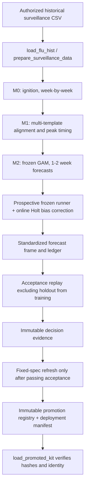

# PAGe production pipeline and consolidation audit

Audit date: 2026-10-01
Repository: `/home/yeli/repos/PAGe`
Scope: read-only inspection of the current checkout, branch refs, package sources, workflow documentation, run scripts, root seasonal folders, and existing package check artifacts. No git refs, tracked source, model logic, or data were changed. This report is the only file created for the audit.

## 1. Executive summary

The repository contains a mature R package and multiple generations of analysis scripts. The repository’s governing status document, `docs/workflow-status.md`, and the seasonal forecast skill identify the latest **deployment-capable pipeline** as the guarded M0 → M1 → M2 stage lifecycle and frozen prospective runner in package `PAGe/`, followed by the separately governed acceptance → fixed-spec refresh → immutable promotion chain. This is the canonical production architecture; it is not any single historical season folder or the research `scripts/fresh_run/` family.

There is an important distinction between code readiness and a released production artifact. The workflow status says a private `v16-corrected` kit is the working incumbent, with `alpha_state=0.20`, `k_sp=8`, and `bias_alpha=0.05`; its source lineage is not fully reconstructible in this checkout. The recorded 2025-26 candidate acceptance replay failed its locked NLL gate. No real-data post-acceptance refit or immutable promotion is recorded as completed. Therefore the canonical release path exists, but this audit cannot claim a newly promoted package or kit.

The peak-week probability API is present in the current checkout (`PAGe/R/peak_week_distribution.R`, exported via `PAGe/NAMESPACE`). It produces an experimental, uncalibrated distribution based on weighted M1 template peaks; its documentation expressly says it captures between-template spread only. Do not interpret it as a calibrated probability of peak timing.

Branch state needs deliberate orchestration. The active working tree is on `feature/peak-week-probability-api`, not `master`; that branch and `asgard-sync-20261001` point to the same 2026-10-01 commit and are 79 commits ahead of the inspected `master` with no master-only commits. The feature tip includes numerous 2026 campaign, governance, and experimental changes, so a single bulk merge should not be assumed safe. The named `agent/m1-v2-from-first-principles` adds another commit beyond the feature tip. `agent/page-governance-audit` and `agent/page-governance-pr` are ancestor work represented in the current long history, not separate merge candidates against the feature tip. `release/latest-package` and `fix/copilot-review-comments` diverge from master and need individual patch-level review.

The pre-existing `PAGe.Rcheck/00check.log` records **3 WARNINGs and 4 NOTEs** (R 4.6.1, dated 2026-09-22), despite installation and tests passing in that historical check. Warnings include undocumented arguments and vignette outputs. It is a saved artifact, not a check run performed during this audit and not proof that current branch sources pass check. A separate directory `PAGe.Rcheck/` and old generated docs/build products are present at repository root and should be treated as disposable outputs only after checking whether they are ignored/untracked and confirming reproducibility.

The user-provided instructions refer to `STOP_RULES.md`, but no such file was found at the repository root or by a repository markdown search. Treat the explicit audit constraints as controlling: no changes to statistical logic/specs and no git writes.

## 2. Production pipeline specification

### Canonical flow



Execution is sequential within each forecast week: M0 supplies ignition to M1, and M1 supplies alignment covariates to M2. The frozen deployment path is the supported production behavior. `weekly_refit` is compatibility/research behavior. Historical observations are private and not bundled: call `load_flu_hist(path=...)` or configure `PAGE_FLU_HIST_FILE`; synthetic examples come from `simulate_flu_seasons()`.

### Entry points and artifacts

| Layer | Canonical sources / APIs | Role and principal output |
|---|---|---|
| Data | `PAGe/R/data_adapter.R`, `PAGe/R/data_contract.R`; `load_flu_hist()`, `prepare_surveillance_data()` | Explicit private CSV input; validates canonical season/week/test/positivity fields. No repository data file is a supported implicit production input. |
| Governed training | `PAGe/R/stage_contracts.R`, `m0_training.R`, `m1_loso.R`, `m2_training.R`; `validate_season_selection()`, `tune_*()`, `validate_*_tuning()`, `fit_*()`, `freeze_*()`, `assemble_kit()` | Disjoint season roles, sequential stage tuning, boundary gates, frozen upstream identity and governed kit assembly. `train_pipeline()` composes this lifecycle for refresh/retune. |
| Inference | `PAGe/R/m0_runtime.R`, `m1_runtime.R`, `m2_runtime.R`, `pipeline_runtime.R`, `pipeline_orchestrator.R`; `run_prospective_pipeline()`, `run_pipeline()`, `run_m0()`, `run_m1()`, `run_m2()` | Frozen weekly run; produces 1- and 2-week ahead forecasts and audit/state outputs. `run_prospective_pipeline()` is the high-level walk-forward interface. |
| Probability / evaluation | `PAGe/R/predictive_distribution.R`, `peak_week_distribution.R`, `evaluation_gates.R`, `promotion_evidence.R` | Forecast distributions and probability helpers; replay summaries, promotion gates, and evidence verification. `summarize_forecast_metrics()`, `summarize_replay_diagnostics()`, `replay_season_holdout()`, `check_promotion()`, `verify_promotion_evidence()`. |
| Acceptance | `scripts/acceptance/replay_2025_26.R` | Replays candidate and incumbent against a held-out season with authorized inputs and checks training exclusion; emits private replay and decision evidence. |
| Fixed-spec refresh | `season2526/run_retrain_venkata.R` | Post-acceptance refresh only, gated on passing bundle/manifest and exact artifacts; supports `--preflight-only`. |
| Promotion/load | `scripts/promotion/promote_post_refit.R`; `load_promoted_kit()` | Validates the evidence/hash chain, writes immutable registry artifact/manifest and refuses collisions; loader verifies hashes and identity. No promotion is recorded complete. |

The working incumbent configuration recorded in `docs/workflow-status.md` is `v16-corrected`: `alpha_state=0.20`, `k_sp=8`, `bias_alpha=0.05`. This configuration is descriptive context only; its private frozen artifact is outside the checkout. The status map records a 2025-26 replay failure on locked NLL (`0.0000482` improvement versus `0.02` required), with horizon and phase gates passing; this did not authorize a refit or promotion. Do not conflate the manuscript’s rotating-holdout analysis with deployment acceptance.

### Peak-week probability API status

`peak_week_distribution()` consumes a `page_forecast` M1 peak ensemble and returns weighted peak-week atoms. `probability_peak_before()` and the generic predictive-distribution helpers compute threshold probabilities. The current implementation labels the output `experimental`, `uncalibrated`; provenance says “between-template spread only.” The API is callable/exported, but it is not evidence of calibrated uncertainty or a promoted deployment interface. Preserve these status labels unless a separately governed calibration evaluation changes them.

### Package and build health

Package source of record is `PAGe/` (R code in `PAGe/R/`, docs generated from roxygen in `PAGe/man/`, API in `PAGe/NAMESPACE`). Root `R/` is not the package source and, in this checkout, `git ls-files R` identifies only `R/globals.R`; do not restore a package-wide root mirror. Quarto sources live under `docs/` and package vignettes under `PAGe/vignettes/`; generated HTML is a snapshot and can be stale.

The checked-in/pre-existing `PAGe.Rcheck/00check.log` says package install, namespace, code checks, examples, and tests passed in that run, but final status was **3 WARNINGs, 4 NOTEs**. It specifically reports missing documented arguments (including `timing_mode` and timing label parameters), vignette source/output mismatch (`inst/doc` absent), possible global bindings, Rd “Lost braces” notes, and `LazyData` without a data directory. Reconcile this old log against current source with a fresh package check before release; this audit did not execute R CMD check. Also inspect the ignored root check output before deleting it. The repository has package tests, but tests were not run for this audit.

## 3. Branch inventory and consolidation matrix

Counts below are `git rev-list --left-right --count master...BRANCH` as observed on 2026-10-01 (master-only first, branch-only second). They are ancestry counts, not independent feature counts: large portions of these branches are common history, and a tip can include experiments, generated outputs, and unrelated work. Mergeability should be tested against the final target using a temporary worktree or `git merge-tree`; do not infer it from counts alone. `master` here is the local branch, while `origin/master` points to the same base as `codex/legacy-model-cleanup` (30 commits ahead of local master).

| Branch/ref | Ahead/behind vs local `master` | Observed status / unique tip information | Recommended action |
|---|---:|---|---|
| `master` | 0 / 0 | Base reference for this comparison. `origin/master` is 30 commits ahead of local `master`. | Keep as target; first have Fury explicitly decide whether the 30-commit `origin/master` update is the actual target base. |
| `feature/peak-week-probability-api` | 0 / 79 | Current checkout and `origin/feature/...` at `50f92e5`; adds `9d5ce1e` peak-week probability API atop the 2026 campaign history. Same tip as `asgard-sync-20261001`. | Review as a stack, not a blind merge. Preserve the API only with its experimental/uncalibrated status and review statistical/governance changes before integration. |
| `asgard-sync-20261001` | 0 / 79 | Exact same tip `50f92e5` as feature branch and `origin/asgard-sync-20261001`; alias/backup of same stack, not an independent merge. | Do not merge separately. Keep temporarily as a recovery ref; delete only after feature stack is integrated and verified. |
| `agent/m1-v2-from-first-principles` | 0 / 80 | Local tip `cbac857` “Add immutable v3 probability API diagnostics”; remote `origin/agent/...` is at `6c64ce8`, which is one commit behind local and contains “Package canonical v3 forecasting weekF12 operations.” | Do not merge as a whole into production without a separate scope decision: its v3/weekF12 work is a distinct pipeline/spec evolution. Archive or retain as research; inspect local-only diagnostics and remote unique API commit independently. |
| `agent/page-governance-audit` | 0 / 77 | Local tip `fd6a4e5` (“experiment: record M1 prior stabilization A0”); remote tip `0d20870` (“feat(m1): add causal decimal-week peak stabilization”). Current feature stack includes these commits in its ancestry. | No separate merge. Classify timing stabilization as a model/spec change requiring independent review; archive branch after confirming the current feature/remote ancestry is the intended record. |
| `agent/page-governance-pr` | 0 / 4 | Local/remote `b6c0dfb`; commits include spread fallback typing, docs, LOSO safety controls, bounded audit fixes. It is ancestor content in the current stack. | No separate merge if current target contains all four commits; verify commit ancestry and retain until integration. |
| `codex/legacy-model-cleanup` | 0 / 30 | Tip `b639e38`, same as `origin/master`; adds “Add explicit Legacy Model settings.” | Treat this as the origin/master synchronization line. Fury should decide and fast-forward/update master to origin/master first, then rebase/re-evaluate every other recommendation against it. Not an extra feature merge. |
| `fix/copilot-review-comments` | 1 / 2 | Local/remote tip `d9f6896`; contains two commits relative to master, while master has one commit not on it. Latest is “fix: address Copilot API documentation review.” | Cherry-pick/replay only after reviewing its exact two commits against updated master. Resolve the divergent master-only change explicitly; do not merge the branch wholesale. |
| `release/latest-package` | 2 / 1 | Local/remote tip `cfc78b4`; latest “feat: publish boundary-aware resumable tuning API”; two master-only commits. | Extract/review the single unique package API change; integrate only if still needed and compatible with current guarded API. Do not merge release branch as-is. |
| `origin/archive/page-2025-26-replay-20260717` | 15 / 1 | One remote-only commit, “Archive executed 2025-26 retrain report source.” | Retain as archive/provenance; do not merge into runtime package without a docs/provenance need. |
| `origin/copilot/fix-pkgdown-issues` | 23 / 1 | One remote-only commit over an old base; “Fix pkgdown issues.” | Inspect the exact patch on updated master; likely cherry-pick if still relevant, otherwise delete stale remote topic after verification. |
| `origin/gh-pages` | 15 / 10 | Published site history, distinct publication branch. | Keep under site-publishing workflow; never merge into source `master`. |
| `origin/HEAD` | alias | Symbolic ref to `origin/master`. | No action. |

`git branch -a` also showed remote tracking refs for feature, governance, asgard, review, release, archive, pkgdown, and gh-pages. The local branch names listed above were present. Feature and asgard branch tips share exactly the same hash, so their 79 commits must not be double-counted as separate incoming work. The large branch diffs include season runners, generated Quarto HTML, package changes, diagnostics, manuscript material, and ignored/untracked local artifacts; the right unit for safe consolidation is reviewed commits or focused topic stacks.

### Recommended sequence

1. Fury confirms the intended canonical target and synchronizes local `master` with `origin/master` (`b639e38`), after capturing current refs and preserving `.serena/` as user data.
2. Compare every proposed patch against the synchronized master. Merge only indispensable documentation/package maintenance fixes first (candidate: boundary-aware resumable tuning API, pkgdown fix, review fixes), each separately with checks and conflict review.
3. Do not merge the entire 79-commit feature stack until its campaign, timing-v2, v2.1/v3, and manuscript changes have an approved scope and independent statistical review. If peak-week API is the goal, isolate the API commit and its exact dependencies into a focused PR/branch.
4. Keep `agent/m1-v2-from-first-principles` separate unless v3 is explicitly adopted as a new model generation. Do not combine its weekF12 semantics with the current incumbent pipeline implicitly.
5. Retire duplicate/stale refs only after final target ancestry and remote publication are verified. Preserve archived replay provenance and `gh-pages` according to their own workflows.

## 4. Archival and cleanup inventory

Cleanup here means an explicit future proposal for Fury, not deletion performed during this audit. No source/data artifacts should be removed merely because they are old. Quarto source pages, package tests, archived evidence, provenance, and the currently governed runner must remain available.

| Path/family | Classification and proposed disposition | Risk / safeguard |
|---|---|---|
| `PAGe/` | Active package source. Keep intact. | Removal or relocation breaks package builds and public API. |
| `scripts/acceptance/`, `scripts/promotion/`, `season2526/run_retrain_venkata.R` | Active governed release tooling. Keep intact. | These are the release gates and evidence chain. |
| `2015/run_2015_api_cycle.R` | Current governed 2015-16 cycle/replay runner per repo context; active for its purpose. Keep. | Do not confuse with historical 2015 helper/test scripts. |
| `2014/`, `2016/`, `2017/`, `2018/`, `2019/`, `2022/` | Season-scoped historical cycle, replay, and tuning sources. Archive as provenance rather than delete. Keep `.qmd` source if linked by docs/build. Candidate archival only for executed one-off shell wrappers after confirming no references and preserving logs/commands. | Several are useful reproducibility records; 2018 and 2019 include source/render pairs. Do not remove QMD targets from Quarto links. |
| `2025/` | Legacy/alternative 2025-26 cycle, ultimate runners, launch/watch scripts, replay and validation. Not the governed acceptance → fixed-spec refresh → promotion chain. Move to `archive/legacy-season-runners/2025/` only after confirming no current operational reference; keep replay/source evidence. | Highest risk: scripts may encode historic private-data lineage. Retain exact files and hashes before archival; do not call them production entry points. |
| `2026/` | 2026-27 final-kit and weekly forecast runners. Their existence alone does not establish governed promotion; inspect `docs/workflow-status.md` updates and manifests. Keep as a quarantined campaign workspace until reviewed; then archive with run manifests, not prune. | May be the current operating cycle and include paths to private artifact storage. Do not delete or execute from this audit. |
| `scripts/fresh_run/` | Explicit research-only historical workflow per status map. Keep research source as provenance; label/archive family under `scripts/archive/` only if all docs/reproduction references are updated. | Removing breaks historical reproduction links; `data/flu_testing_data.csv` absent, so not an out-of-box pipeline. |
| Root `scripts/run_nested_loso_v*`, `_rebuild_m2_production_*`, `_extended_tune_m1*`, `_holdout_2025_26.R`, diagnostics and `test_*` scripts | Superseded/research-only except canonical scripts called out above. Prefer archival by coherent family after reference scan, not deletion. | Some are cited in manuscript and historical docs; keep an index and preserve run-specific parameters. |
| Root `R/` | Not package source; only `R/globals.R` is tracked in this checkout. Do not copy package files here. Check whether any script sources this single file; remove only after reference scan and an explicit commit. | `PAGe/R/` is the sole package source; root mirror risks divergent implementations. |
| `docs/*.html`, seasonal `*/**/*.html`, rendered book outputs | Generated snapshots, potentially stale. Keep until confirming Quarto site/book config and whether HTML is intentionally committed; rebuild only from source and without pretending private evidence. Consider pruning generated outputs in a separate docs policy change. | Deleting referenced HTML can break local links or site publication. Quarto builds should use `.qmd` sources. |
| `PAGe.Rcheck/` | Local R CMD check output, not source. Safe cleanup candidate only if untracked/ignored and no active diagnostic needs it; preserve `00check.log` summary in issue/report first. | Contains the only inspected package check record; do not delete before preserving its status. |
| `docs/scratch_v16_params.rds`, `test/test.RData`, root/test RDS or serialized scratch files | Scratch/research outputs. Inventory all tracked/untracked files and provenance first; archive private evidence in approved artifact storage, remove local copies only when policy permits. | May contain sensitive or sole-copy run evidence; no RDS files should be blindly pruned. |
| `output/`, `results/`, `data/`, `flualign/`, `manuscript/results/` | Mixture of local outputs, ignored private artifacts, simulated prototypes, manuscript/research products. Do not bulk archive or delete. Use `.gitignore`, manifests, and `docs/artifact-storage.md` to distinguish tracked source from private evidence. | Could include sensitive/private data or sole run artifacts. `results/` includes SIMULATED artifacts; do not mislabel synthetic outputs as production. |
| `PAGe-m2-a-full` sibling workspace | Outside this repo and not part of canonical source. Treat as unversioned research workspace; no integration based on directory presence. | Must be diffed against package/history before any salvage; do not copy wholesale. |
| `.serena/` | Untracked directory shown by `git status`; likely user/tool local state. Leave untouched and ensure Fury’s worktree operations do not discard it. | Local state can include user context/cache. |

Before archiving any file, run `rg` for path and basename references across scripts, package, docs, Quarto project config, CI, and book config; inspect `git ls-files`, `git check-ignore -v`, and file hashes. Archive only tracked source/evidence that policy says to retain. Prune only confirmed generated, reproducible, untracked files after explicit approval from the owner of local evidence. Never archive private data into git.

## 5. Fury runbook

Commands below are a proposed parent-orchestrator sequence. Run from the repository root. The git mutating commands are intentionally reserved for Fury; none were run for this audit. Use a backup ref/worktree and inspect each result before proceeding.

### A. Preserve state and establish target

```sh
cd /home/yeli/repos/PAGe
git status --short --branch
git show-ref --heads --tags
git branch -avv
git log --graph --oneline --decorate --all -n 100
git diff --name-status master...origin/master
git rev-list --left-right --count master...origin/master
```

Preserve the untracked `.serena/` directory outside any cleanup operation. If `origin/master` at `b639e38` is the approved target, create a recovery ref and fast-forward local `master` only if it is a clean fast-forward and the operator is on a safe worktree:

```sh
git branch backup/master-before-20261001 master
git switch master
git merge --ff-only origin/master
```

If the working tree is not clean or current branch state is needed, do this in a new worktree instead; do not force-switch or reset.

### B. Review candidate topic changes without merging the large stack

```sh
git log --oneline master..release/latest-package
git diff --stat master...release/latest-package
git log --oneline master..fix/copilot-review-comments
git diff --stat master...fix/copilot-review-comments
git log --oneline master..origin/copilot/fix-pkgdown-issues
git diff --stat master...origin/copilot/fix-pkgdown-issues
git log --oneline master..feature/peak-week-probability-api
git diff --stat master...feature/peak-week-probability-api
```

Use isolated branches/worktrees to test candidate merges. Prefer `git cherry-pick -x <reviewed-commit>` for a small, reviewed fix; otherwise open a PR. Run package documentation and check workflows after any package/API integration, with authorized/synthetic inputs appropriate to the test. Never merge `asgard-sync-20261001` separately from `feature/peak-week-probability-api`.

### C. Compare ancestry and mergeability before retiring refs

```sh
git merge-base --is-ancestor agent/page-governance-pr feature/peak-week-probability-api
git merge-base --is-ancestor agent/page-governance-audit feature/peak-week-probability-api
git merge-base --is-ancestor asgard-sync-20261001 feature/peak-week-probability-api
git merge-base --is-ancestor feature/peak-week-probability-api agent/m1-v2-from-first-principles
git log --left-right --cherry-pick --oneline master...fix/copilot-review-comments
git log --left-right --cherry-pick --oneline master...release/latest-package
```

Where supported, inspect `git merge-tree` output or merge in a disposable worktree. Resolve every model/statistical change as an explicit review item; do not auto-resolve conflicts in parameter or evaluation code.

### D. Cleanup only after integration, verification, and retention review

```sh
rg -n 'scripts/fresh_run|2014/|2015/|2016/|2017/|2018/|2019/|2022/|2025/|2026/' docs PAGe scripts .github
git ls-files 2014 2015 2016 2017 2018 2019 2022 2025 2026 scripts/fresh_run
git check-ignore -v PAGe.Rcheck output results data docs/scratch_v16_params.rds
```

Archive through a separate reviewed change that retains source, manifests, and an index; update links and Quarto project inputs in that same change. Remove only confirmed disposable local check outputs after the historical status has been recorded. Do not commit private data or local evidence into `archive/`.

### E. Release verification

After approved package changes, run the project’s package check and documentation workflow from the selected clean worktree, then reconcile results against the old `PAGe.Rcheck/00check.log`. Verify synthetic/public package workflows without private inputs. For deployment claims, require authorized data, immutable candidate/incumbent kits, passing acceptance evidence, and the full verified promotion chain. Report check warnings and promotion state honestly; a package check is not model acceptance.

## Audit limitations

Branch names and ancestry were inspected locally on 2026-10-01; remote refs may advance. The sibling `PAGe-m2-a-full` was confirmed to exist but was not diffed against this repository. Private artifact roots and data were not read. Package checks/tests were not rerun. No claim is made about the statistical validity of proposed new model generations or about a completed current-season promotion.
