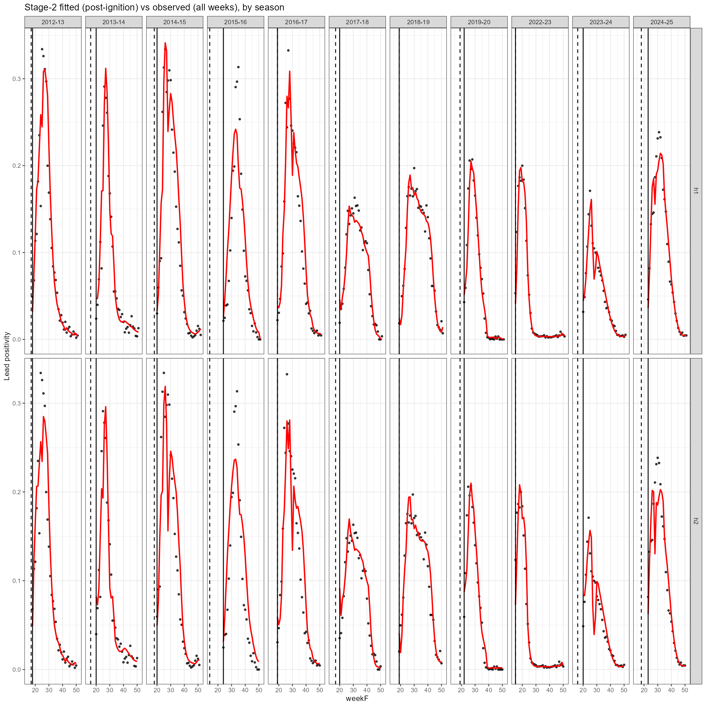

```{=html}
<style>

h2 {
  margin-top: 1.8em;
  padding: 0.4em 0.9em;
  border-left: 5px solid #1e5f8e;
  background: #e8f1f8;
  color: #1a3a5c;
  border-radius: 0 4px 4px 0;
}
h3 {
  margin-top: 2em;
  padding: 0.4em 0.8em;
  border-left: 4px solid #4a90d9;
  background: #f4f8fd;
  border-radius: 0 4px 4px 0;
}
h4 {
  margin-top: 1.5em;
  padding: 0.3em 0.7em;
  border-left: 3px solid #a0bfe0;
  background: #f9fbfe;
  border-radius: 0 3px 3px 0;
}
</style>
```

::: {.callout-important}
## At A Glance

- `$M_0$` detects ignition prospectively from raw surveillance data.
- `$M_1$` aligns the current season to historical templates and estimates epidemic phase and peak timing.
- `$M_2$` consumes alignment-derived covariates plus real-time features to forecast 1- and 2-week-ahead positivity.
- The linked documents contain the full derivations, tuning runs, and deployment workflow; this page is the map between them.
:::

## Notation

Let $s = 1,\dots,S$ index influenza seasons and let $w$ denote the within-season flu-week number. For each season–week $(s,w)$, define:

- $x_{s,w}$: number of influenza-positive tests (code column `y`)
- $n_{s,w}$: number of tests performed (code column `N`)
- $p_{s,w} = x_{s,w} / n_{s,w}$: observed weekly positivity (code column `p`)
- $\pi_{s,w}$: underlying probability of positivity (the quantity modelled/forecast)

Several week indices are kept in the data:

- `week`: MMWR **epidemiologic week-of-year** from surveillance data.
- `weekS`: **surveillance-week index** (season starts at MMWR week 35), for interpretation only.
- `weekF`: $w^f_{s,w}$, **flu-week index** (flu season starts at MMWR week `startWeek`; here 27).
- `iWeek`: $w^{(\mathrm{ign})}_s$, ignition week for season $s$ (manually labelled or estimated).
- `anchorWeek`: $w^{an}$, anchor week for alignment (median ignition week across seasons).
- `newWeek`: $w^a_{s,w}$, **aligned week index** after shifting $w^f_{s,w}$ so that $w^{(\mathrm{ign})}_s$ lines up at `anchorWeek` across seasons
- `peak`: $w^p_s$, week of the season's epidemic peak (estimated by alignment).

Let $P(s,w)\in\{0,1\}$ be a phase indicator:
$$
P(s,w)=
\begin{cases}
0, & \text{pre-ignition (pre-season)}\\
1, & \text{post-ignition (in-season)}
\end{cases}
$$

The framework has 3 main components:

- **$M_0$ (Ignition detector):** using only information available up to week $w$, estimate whether the season has ignited ($P(s,w)=1$), estimate reference curve.
- **$M_1$ (Alignment):** shifts and stretches the estimated reference curve to fit the observed data, producing an estimate of the current epidemic phase and a rough forecast trajectory.
- **$M_2$ (Forecast model):** once ignition is detected and aligned, build forecast model and forecast $h$ weeks ahead:
$$
\pi_{s,w+h} \;=\; \Pr\!\big(\text{positive at } w+h \mid P(s,w)=1,\, M_1\big).
$$

Primary forecasting targets are one- and two-week-ahead positivity $\pi_{s,w+1}$ and $\pi_{s,w+2}$. Raw surveillance data is converted to a within-season week index (`weekF`) starting at MMWR week 27. Each row is one season-week with columns `y` (positive tests), `N` (total tests), and `p = y/N`. Seasons with known data quality issues (`2020-21`, `2021-22`) are excluded.


---

## $M_0$ — Ignition Detection {#sec-m0}

**Goal:** detect the start of the epidemic season in real time.

$M_0$ votes each week using four threshold-based gates (`cond_sum`, `cond_p`, `cond_prev`, `cond_inc`) capturing level, trend, cumulative burden, and sustained elevation from data available up to the current week only. Ignition fires when all four agree simultaneously within a tuned eligibility window. Gate thresholds are selected by LOSO grid search against known ignition weeks, minimising detection timing error. Once ignition locks at $\hat{w}^{(\mathrm{ign})}_s$, the aligned coordinate system activates:

$$
w^a_{s,w} = w^f_{s,w} - \hat{w}^{(\mathrm{ign})}_s + w^{an}.
$$

**Key functions:** `tuneIgnitionGrid_M0v2()`, `detectIgnitionBySeason_M0v2()`, `run_ignition_weekly()`

**Full analysis:** [`ignition_training.html`](ignition_training.html)

---

## $M_1$ — Curve Alignment {#sec-m1}

**Goal:** align observed epidemic curves to historical templates to continuously estimate peak timing.

After ignition, each week's partial curve is aligned to each training season's template in parallel using a 4-parameter dilation model ($\tau_w$, $\delta_w$, $a_w$, $b_w$). Template fits are ensemble-weighted by alignment quality (NLL) via softmax, yielding a continuously updated peak estimate. Once the peak is detected (`peak_passed == TRUE`), alignment freezes.

### Reference curve estimation {#sec-refcurve}

Historical seasons are aligned to their manually-labelled ignition weeks ($w^{(\mathrm{ign})}_s$) at the median anchor $w^{an}$:

$$
w^a_{s,w} = w^f_{s,w} - w^{(\mathrm{ign})}_s + w^{an}.
$$

The factor-smooth (`"fs"`) method fits a GAM with `s(newWeek, season, bs="fs")`, returning per-season curves `eta_mat` used for multi-template alignment.

**Key functions:** `flagIgnition()`, `alignIgnition()`, `estimateRef()`, `learn_alignment_hyperparams()`

**Full analysis:** [`estimateRef.html`](estimateRef.html)

### Post-peak flag tuning {#sec-peak-tuning}

`tune_peak_detection()` selects `use_ci` and `buffer_weeks` to minimise detection delay with zero false positives.

**Full analysis:** [`peak_detection_tuning.html`](peak_detection_tuning.html)

### Training {#sec-m1-training}

All $M_1$ hyperparameters are tuned by leave-one-season-out walk-forward evaluation (153-config grid): each fold re-estimates the reference curve excluding the held-out season, then walks forward week by week producing `params_df`. Peak MAE under Weibull weighting is the primary metric.

**Tuned configuration:** `k_ref=25`, `temperature=0.25`, `shift=0` → Weibull peak MAE = 1.169 weeks.

**Key functions:** `loso_walkforward()`, `tune_m1_alignment()`

**Full analysis:** [`loso_walkforward.html`](loso_walkforward.html)

### Deployment {#sec-run}

Each week `align_multi_template()` is called with frozen `ref`, `hyper`, `params`, and tuned ensemble parameters, returning `state` (`"pre_ignition"` / `"aligning"` / `"post_peak"`), peak estimate with CI, and aligned covariates for $M_2$.

**Key functions:** `run_alignment_prospective()`, `align_multi_template()`

---

## $M_2$ — Forecast Model {#sec-m2}

**Goal:** forecast 1- and 2-week-ahead positivity using $M_1$ alignment outputs.

$M_2$ fits a joint binomial GAM for $h \in \{1,2\}$ on aligned-week space. Covariates from $M_1$ (`newWeek`, template backbone $z_{s,w}(\delta, Kr)$) are leakage-sensitive — they depend on $g_{\mathrm{ref}}$. Real-time covariates (EWMA state $z^{(\mathrm{ema})}_{s,w}$, slope $d1$, curvature $d2$) are computed from raw surveillance data and do not leak.

### Training {#sec-m2-training}

Hyperparameters are selected by **nested LOSO**: for each held-out season, the reference curve and all $M_1$ predictions are re-estimated on the remaining seasons only, eliminating template leakage. Phase 1 pre-computes $M_1$ predictions once per fold; Phase 2 sweeps the $M_2$ spec grid in minutes.

**Tuned spec** (189-spec nested LOSO, 10 seasons, mean NLL = 33.19):
```
delta=0, Kr=1, k_f=2, k_e=4, k_1=4, k_2=0, k_w=0, k_s=0
alpha_state=0.10, lambda_w=0, w_floor=0.05
```

**Key functions:** `nested_loso_build_fold()`, `m1_walkforward_multi()`, `nested_loso_m2_train()`, `nested_loso_m2_eval()`, `prep_stage2_joint()`, `train_stage2_joint()`

**Full design:** [`forecast_training.html`](forecast_training.html)

### Deployment {#sec-m2-deploy}

Each week after ignition, $M_2$ refits on all historical aligned data plus the current-season observations accumulated so far, then forecasts 1- and 2-weeks ahead. Refitting picks up the live positivity trend and prevents the forecast from drifting from observed data. A frozen-fit fallback (`mode="frozen"`) is available for diagnostics.

**Key functions:** `run_m2_forecast()` (`mode="weekly_refit"` default), `refit_stage2_weekly()`, `load_prospective_kit()`

### Retrospective deployment {#sec-m2-retro}

Before the live season begins, $M_2$ is fit on all historical seasons using the best nested-LOSO spec and the production reference curve (`nested_loso_refit_best()`). Because the spec was selected by nested LOSO — which never exposes any fold's test season to its own training — this fit is leakage-free: each season's fitted trajectory reflects only information that would have been available prospectively. The result serves as a sanity check (fitted curves should track observed positivity) and provides the baseline model state before any current-season data arrive.

{width=100%}

**Full code:** [`forecast_training.html §Fit-back`](forecast_training.html)

---

## Deployment sequence {#sec-train-deploy}

Within each week: $M_1$ aligns → for any post-ignition state, $M_2$ refits on historical + current data, then forecasts. Full implementation: [`prospective_deployment.html`](prospective_deployment.html).

| Step | What | When |
|------|------|------|
| 1 | Reference curve + `hyper` | Offline, once |
| 2 | $M_0$ ignition thresholds | Offline, once |
| 3 | $M_1$ LOSO walk-forward → `params_df` | Offline, once |
| 4 | Post-peak flag parameters | Offline, once |
| 5 | $M_2$ nested LOSO hyperparameter tuning | Offline, once |
| 6 | $M_2$ initial fit on full historical data | Offline, before season start |
| **7** | **Weekly: $M_1$ aligns → $M_2$ refits (hist + current) → forecast** | **Online, every week** |

---

## Linked Documents {#sec-docmap}

| Document | Primary purpose |
|----------|-----------------|
| [`estimateRef.html`](estimateRef.html) | Build and inspect the aligned historical reference curve and per-season FS curves |
| [`ignition_training.html`](ignition_training.html) | Define the ignition gates and tune `$M_0$` thresholds by LOSO |
| **[`loso_walkforward.html`](loso_walkforward.html)** | **Tune `$M_1$` alignment and inspect walk-forward peak estimation behaviour** |
| [`peak_detection_tuning.html`](peak_detection_tuning.html) | Tune the post-peak stopping rule |
| [`forecast_training.html`](forecast_training.html) | Specify and tune `$M_2$`, including nested LOSO evaluation |
| [`m1_m2_stacking.html`](m1_m2_stacking.html) | Describe how walk-forward `$M_1$` predictions replace the static `$M_2$` template feature |
| [`prospective_deployment.html`](prospective_deployment.html) | Show the live `$M_0 \to M_1 \to M_2$` walk-forward pipeline on the current season |
| [`run.html`](run.html) | Legacy `$M_1$`-only current-season alignment view |
| *(this document)* | Provide the cross-document map and stage-level architecture summary |

---

## Key design choices

**Multi-template ensemble alignment.** Instead of forcing all seasons into one population reference shape, the FS reference method produces per-season curves. M₁ aligns to each training season's curve independently and ensembles forecasts via softmax weighting on NLL. This allows the model to recognize which historical season the current one most resembles (e.g., steep 2022–23 vs gradual 2017–18) without being constrained to a single population template. Temperature controls how strongly the model commits to the best-matching template.

**Weekly refit at deployment.** Each week, $M_2$ is refitted on all historical
aligned seasons plus the current-season observations accumulated to that week.
This lets the model track the live positivity trend and avoids forecasts that
diverge from observed data. The historical aligned dataset is precomputed offline
and stored in `ref_production.rds`; the per-week cost is small (< 1 s on ~275 rows).
The season random effect is excluded at prediction time (`s(season)` dropped)
so the model generalises to the unseen current season. A `mode="frozen"` fallback
in `run_m2_forecast()` retains the pre-2026 frozen-fit behaviour for diagnostics.

**Reference curve uses known labels (@sec-refcurve before @sec-m0).** The reference
curve (and per-season FS curves) are estimated from retrospectively labelled ignition weeks — not from
the prospective detector. This separation means the templates are not corrupted
by detection errors, and the prospective detector is evaluated independently.

**Stateless prospective function.** `align_multi_template()` and `run_alignment_prospective()` take the
current data and return the current state — the caller decides whether to keep
calling. The same functions power both the LOSO inner loop and production
deployment, guaranteeing identical behaviour.

**LOSO grid search for multi-template tuning.** All M₁ tuning (`k_ref`, `multi_temperature`, `template_shift`)
uses walk-forward LOSO so that no future data leaks into training. A 4×3×4 grid (baseline 81 configs, extended ~120 configs) is evaluated
to find the peak MAE minimizer under Weibull weighting. Ignition
detector thresholds are tuned in an earlier LOSO pass (@sec-m0).

**Alignment stops at peak.** Once `peak_passed == TRUE`, alignment freezes.
This prevents the descending limb from distorting the peak estimate, and
cleanly separates the peak prediction module from any downstream forecasting.

**Two-stage identifiability guard.** Two parameters are activated progressively
as data accumulate. The slope $b_w$ is fixed at 1 (`allow_scale = FALSE`) until
sufficient data span the curve. The dilation $\delta_w$ is fixed at 0
(`delta_on = FALSE`) until a further threshold is crossed. This prevents
numerically unstable estimates early in the season when few observations are
available.

**Covariate capping for out-of-range extrapolation.** The `s(logN_now)` smooth in $M_2$
is trained on historical testing volumes (N ≤ 16,310; logN ≤ 9.70). When the current
season's testing volume exceeds the training range (e.g., 2025–26 peaked at N = 39,290;
logN = 10.58), the flexible smooth (edf ≈ 5) extrapolates unreliably. At prediction time,
`logN_now` is capped at the training data range to prevent this.

**Soft ceiling on predicted positivity.** Historical peak positivity never exceeds
~34%. A smooth soft-ceiling function, derived from the training data distribution,
prevents the GAM from predicting unrealistically high values in extrapolation
scenarios. The function is identity below the 95th percentile of training
positivity (~26%), then tanh-squashes toward a data-driven ceiling
($p_{\max}^{(\mathrm{train})}$ + buffer ≈ 37%). This provides a principled,
smooth constraint rather than a hard clip: predictions near the historical
maximum are barely affected (≤2% reduction), while extreme extrapolations
(e.g., 57% → 37%) are strongly compressed.
