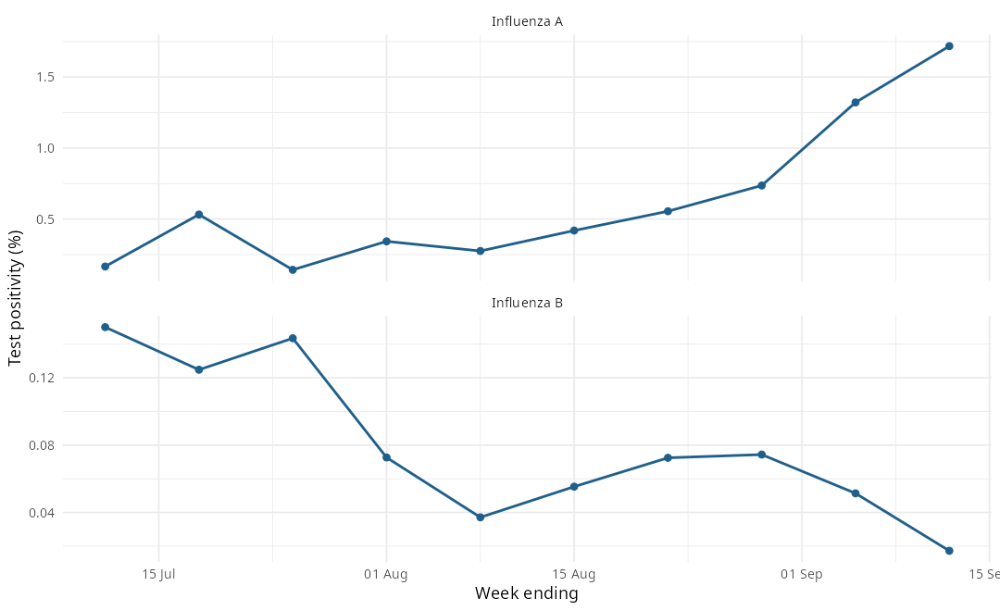

## Executive Summary

- **Season:** 2026-27; latest observed origin Week 10 (week ending 12 Sep 2026).
- **Influenza A positivity:** 1.718% (101 positive of 5,880 tests).
- **Influenza B positivity:** 0.017% (1 positive of 5,815 tests).
- **M0 ignition:** not detected.
- **M1 timing:** not available.
- **M2 outlook:** Pre-window: no validated M2 forecast is issued before Week 12.
- **Walk-forward review:** as-of tabs for Week 8 through Week 10.

## Observed Surveillance

Weekly provincial test counts and positivity for Influenza A and Influenza B.

| Week | Week ending | Flu A positive | Flu A tests | Flu A % | Flu B positive | Flu B tests | Flu B % |
| :--- | :--- | :--- | :--- | :--- | :--- | :--- | :--- |
| 1 | 11 Jul 2026 | 10 | 6,026 | 0.166% | 9 | 5,996 | 0.150% |
| 2 | 18 Jul 2026 | 30 | 5,640 | 0.532% | 7 | 5,610 | 0.125% |
| 3 | 25 Jul 2026 | 8 | 5,609 | 0.143% | 8 | 5,575 | 0.143% |
| 4 | 1 Aug 2026 | 19 | 5,537 | 0.343% | 4 | 5,506 | 0.073% |
| 5 | 8 Aug 2026 | 15 | 5,449 | 0.275% | 2 | 5,392 | 0.037% |
| 6 | 15 Aug 2026 | 23 | 5,488 | 0.419% | 3 | 5,423 | 0.055% |
| 7 | 22 Aug 2026 | 31 | 5,586 | 0.555% | 4 | 5,520 | 0.072% |
| 8 | 29 Aug 2026 | 40 | 5,433 | 0.736% | 4 | 5,378 | 0.074% |
| 9 | 5 Sep 2026 | 78 | 5,903 | 1.321% | 3 | 5,842 | 0.051% |
| 10 | 12 Sep 2026 | 101 | 5,880 | 1.718% | 1 | 5,815 | 0.017% |

## Walk-Forward As-Of Review

Each tab replays the information available at that origin week: the observed
surveillance state, M0 ignition status, M1 peak timing, and the M2 forecast
(or a pre-window notice before Week 12).

::: {.panel-tabset}

### Week 8

**Surveillance state** (week ending 29 Aug 2026)

| Virus | Positive | Tests | Positivity |
| :--- | :--- | :--- | :--- |
| Influenza A | 40 | 5,433 | 0.736% |
| Influenza B | 4 | 5,378 | 0.074% |

- **M0 ignition:** not detected
- **M1 timing:** not available
- **M2 forecast:**
  - Not issued at Week 8 (validated M2 window opens at Week 12).

### Week 9

**Surveillance state** (week ending 5 Sep 2026)

| Virus | Positive | Tests | Positivity |
| :--- | :--- | :--- | :--- |
| Influenza A | 78 | 5,903 | 1.321% |
| Influenza B | 3 | 5,842 | 0.051% |

- **M0 ignition:** not detected
- **M1 timing:** not available
- **M2 forecast:**
  - Not issued at Week 9 (validated M2 window opens at Week 12).

### Week 10

**Surveillance state** (week ending 12 Sep 2026)

| Virus | Positive | Tests | Positivity |
| :--- | :--- | :--- | :--- |
| Influenza A | 101 | 5,880 | 1.718% |
| Influenza B | 1 | 5,815 | 0.017% |

- **M0 ignition:** not detected
- **M1 timing:** not available
- **M2 forecast:**
  - Not issued at Week 10 (validated M2 window opens at Week 12).

:::

