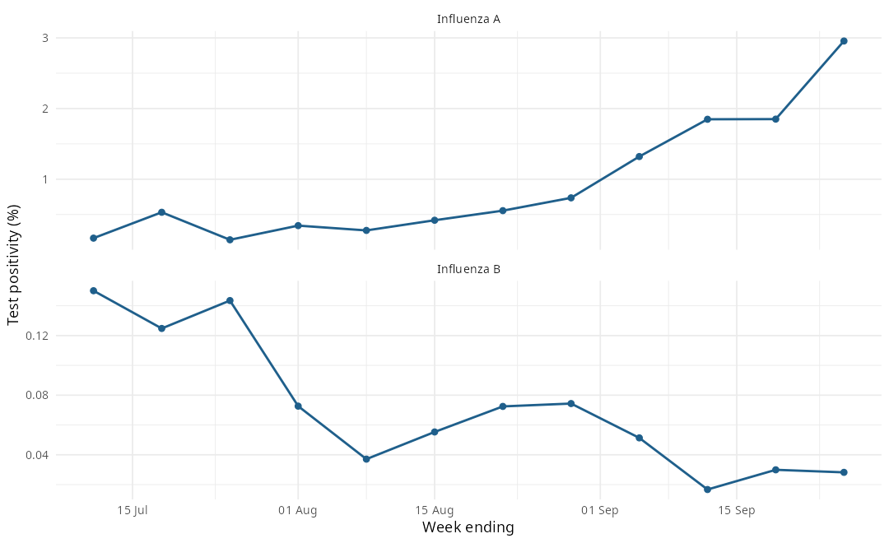

## Executive Summary

- **Season:** 2026-27; latest observed origin Week 12 (week ending 26 Sep 2026).
- **Influenza A positivity:** 2.956% (212 positive of 7,172 tests).
- **Influenza B positivity:** 0.028% (2 positive of 7,089 tests).
- **M0 ignition:** detected at Week 12.
- **M1 timing:** peak Week 20.21 (90% 17.08-23.28).
- **M2 outlook:** Influenza A 3.517% (+1 week) and 3.497% (+2 weeks); Influenza B 0.038% (+1 week) and 0.039% (+2 weeks).
- **Walk-forward review:** as-of tabs for Week 8 through Week 12.

## Observed Surveillance

Weekly provincial test counts and positivity for Influenza A and Influenza B.

| Week | Week ending | Flu A positive | Flu A tests | Flu A % | Flu B positive | Flu B tests | Flu B % |
| :--- | :--- | :--- | :--- | :--- | :--- | :--- | :--- |
| 1 | 11 Jul 2026 | 10 | 6,026 | 0.166% | 9 | 5,996 | 0.150% |
| 2 | 18 Jul 2026 | 30 | 5,640 | 0.532% | 7 | 5,610 | 0.125% |
| 3 | 25 Jul 2026 | 8 | 5,609 | 0.143% | 8 | 5,575 | 0.143% |
| 4 | 1 Aug 2026 | 19 | 5,537 | 0.343% | 4 | 5,506 | 0.073% |
| 5 | 8 Aug 2026 | 15 | 5,450 | 0.275% | 2 | 5,393 | 0.037% |
| 6 | 15 Aug 2026 | 23 | 5,488 | 0.419% | 3 | 5,423 | 0.055% |
| 7 | 22 Aug 2026 | 31 | 5,586 | 0.555% | 4 | 5,520 | 0.072% |
| 8 | 29 Aug 2026 | 40 | 5,433 | 0.736% | 4 | 5,378 | 0.074% |
| 9 | 5 Sep 2026 | 78 | 5,906 | 1.321% | 3 | 5,843 | 0.051% |
| 10 | 12 Sep 2026 | 112 | 6,060 | 1.848% | 1 | 5,989 | 0.017% |
| 11 | 19 Sep 2026 | 125 | 6,755 | 1.850% | 2 | 6,684 | 0.030% |
| 12 | 26 Sep 2026 | 212 | 7,172 | 2.956% | 2 | 7,089 | 0.028% |

## Walk-Forward As-Of Review

Each tab replays the information available at that origin week: the observed
surveillance state, M0 ignition status, M1 peak timing, and the M2 forecast
(or a pre-window notice before Week 12).

::: {.panel-tabset}

### Week 8

**Surveillance state** (week ending 29 Aug 2026)

| Virus | Positive | Tests | Positivity |
| :--- | :--- | :--- | :--- |
| Influenza A | 40 | 5,433 | 0.736% |
| Influenza B | 4 | 5,378 | 0.074% |

- **M0 ignition:** not detected
- **M1 timing:** not available
- **M2 forecast:**
  - Not issued at Week 8 (validated M2 window opens at Week 12).

### Week 9

**Surveillance state** (week ending 5 Sep 2026)

| Virus | Positive | Tests | Positivity |
| :--- | :--- | :--- | :--- |
| Influenza A | 78 | 5,906 | 1.321% |
| Influenza B | 3 | 5,843 | 0.051% |

- **M0 ignition:** not detected
- **M1 timing:** not available
- **M2 forecast:**
  - Not issued at Week 9 (validated M2 window opens at Week 12).

### Week 10

**Surveillance state** (week ending 12 Sep 2026)

| Virus | Positive | Tests | Positivity |
| :--- | :--- | :--- | :--- |
| Influenza A | 112 | 6,060 | 1.848% |
| Influenza B | 1 | 5,989 | 0.017% |

- **M0 ignition:** not detected
- **M1 timing:** not available
- **M2 forecast:**
  - Not issued at Week 10 (validated M2 window opens at Week 12).

### Week 11

**Surveillance state** (week ending 19 Sep 2026)

| Virus | Positive | Tests | Positivity |
| :--- | :--- | :--- | :--- |
| Influenza A | 125 | 6,755 | 1.850% |
| Influenza B | 2 | 6,684 | 0.030% |

- **M0 ignition:** not detected
- **M1 timing:** not available
- **M2 forecast:**
  - Not issued at Week 11 (validated M2 window opens at Week 12).

### Week 12

**Surveillance state** (week ending 26 Sep 2026)

| Virus | Positive | Tests | Positivity |
| :--- | :--- | :--- | :--- |
| Influenza A | 212 | 7,172 | 2.956% |
| Influenza B | 2 | 7,089 | 0.028% |

- **M0 ignition:** detected at Week 12
- **M1 timing:** peak Week 20.21 (90% 17.08-23.28)
- **M2 forecast:**

| Virus | +1 week | +2 weeks |
| :--- | :--- | :--- |
| Influenza A | 3.517% (Week 13) | 3.497% (Week 14) |
| Influenza B | 0.038% (Week 13) | 0.039% (Week 14) |

:::

